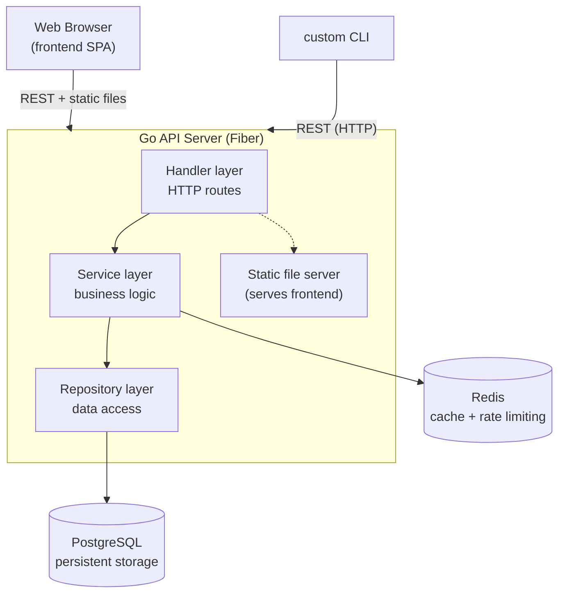

# customurls

[](https://go.dev/)
[](https://gofiber.io/)
[](https://www.postgresql.org/)
[](https://redis.io/)
[](https://www.docker.com/)
[](LICENSE)

A production URL shortener with custom aliases, QR codes, click tracking, and a command-line client. Live at **[customurls.in](https://customurls.in)**.

---

## Features

- **Shorten URLs** — turn any long link into a short one
- **Custom aliases** — pick your own memorable short link instead of a random ID
- **Configurable expiry** — links expire after a set time (default: 3 days)
- **QR codes** — generate a scannable QR for any short link, as a PNG
- **Click tracking** — see how many times a link has been visited
- **Rate limiting** — per-IP request quota backed by Redis
- **Redis caching** — redirects are served from cache for speed
- **Command-line client** — `custom`, a CLI to shorten and inspect links from your terminal
- **Web interface** — a clean single-page frontend with link history (stored locally in the browser)

---

## Tech Stack

| Layer        | Technology                          |
|--------------|-------------------------------------|
| Backend      | Go 1.25, [Fiber](https://gofiber.io/) v2 |
| Database     | PostgreSQL 16 via [GORM](https://gorm.io/) |
| Cache / Rate limiting | Redis 7                    |
| Frontend     | Vanilla HTML / CSS / JavaScript      |
| CLI          | Go, [Cobra](https://github.com/spf13/cobra) |
| QR generation | [go-qrcode](https://github.com/skip2/go-qrcode) |
| Config       | [envconfig](https://github.com/kelseyhightower/envconfig) |
| Deployment   | Docker, Docker Compose               |

---

## Architecture

The API follows a clean, layered architecture. The Go server serves both the
REST API and the static frontend on a single port. The `custom` CLI is an
independent client that talks to the same API over HTTP.



**Request flow for a redirect:** the handler checks Redis first; on a cache
miss it reads from PostgreSQL, populates the cache, increments the hit counter,
and issues the redirect.

---

## Project Structure

```
customurls/
├── cmd/
│   ├── api/main.go            # API server entry point
│   └── custom/main.go         # CLI entry point
├── internal/
│   ├── app/app.go             # dependency wiring, route registration
│   ├── server/http.go         # Fiber server setup
│   ├── shorturl/              # core domain: handler, service, repository, models
│   ├── platform/redis/        # Redis client, cache, rate limiter
│   ├── middleware/            # rate-limiting middleware
│   ├── helpers/               # shared helpers
│   └── cli/                   # custom command implementations
├── config/config.go           # environment-based configuration
├── frontend/                  # static web interface (HTML/CSS/JS)
├── migrations/urls.sql         # database schema reference(planned, see Roadmap)
├── Dockerfile
└── docker-compose.yml
```

---

## Getting Started

### Prerequisites

- [Docker](https://www.docker.com/) and Docker Compose
- (Optional) Go 1.25+ to build the `custom` CLI locally

### Configuration

The API is configured through environment variables. Create a `.env` file in
the project root:

| Variable       | Required | Default          | Description                              |
|----------------|----------|------------------|------------------------------------------|
| `DATABASE_URL` | yes      | —                | PostgreSQL connection string             |
| `REDIS_ADDR`   | no       | `localhost:6379` | Redis address                            |
| `DOMAIN`       | yes      | —                | Domain used to build short URLs          |
| `API_QUOTA`    | no       | `10`             | Max requests per IP within the rate window |
| `PORT`         | no       | `8080`           | Port the API server listens on           |

Example `.env` for local development:

```env
DATABASE_URL=host=postgres user=postgres password=postgres dbname=customurls port=5432 sslmode=disable
REDIS_ADDR=redis:6379
DOMAIN=localhost:8080
API_QUOTA=10
PORT=8080
```

### Run with Docker Compose

```bash
docker compose up --build -d
```

This starts PostgreSQL, Redis, and the API server. The API server also serves
the web frontend. Open **http://localhost:8080**.

To stop:

```bash
docker compose down
```

---

### Build

```bash
go build -o custom ./cmd/custom
```

Or install it to your `$GOPATH/bin`:

```bash
go install ./cmd/custom
```

### Commands

**Shorten a URL:**

```bash
custom short https://example.com/very/long/url
custom short https://example.com --alias my-link
custom short https://example.com --qr           # also prints a QR in the terminal
custom short https://example.com --json          # machine-readable output
```

**Check stats:**

```bash
custom stats Xy12Ab
custom stats https://customurls.in/my-link/Xy12Ab  # full URL also works
custom stats Xy12Ab --json
```

**Version:**

```bash
custom version
```

> **Tip:** wrap URLs containing `&`, `?`, or `%` in single quotes so your shell
> doesn't interpret them: `custom shorten 'https://example.com/?a=1&b=2'`

---

## How It Works

A few implementation details worth noting:

- **Read-through cache.** On a redirect, the service checks Redis before
  PostgreSQL. Cache hits skip the database entirely; misses populate the cache
  for next time.
- **Per-IP rate limiting.** A Redis-backed middleware enforces `API_QUOTA`
  requests per IP within a rolling window, and returns the remaining quota in
  the `/shorten` response.
- **Route ordering.** Fiber matches routes in registration order, so specific
  routes (`/shorten`, `/stats/:id`, `/qr/:id`) and the static file server are
  registered *before* the catch-all `/:shortID` redirect handler.
- **Single-binary serving.** The Go server serves the REST API and the static
  frontend together on one port — no separate web server needed.

---

## Roadmap

- [ ] **gRPC microservices** — split the service using the definitions in `proto/url.proto`
- [ ] **Analytics dashboard** — per-click data (timestamp, referrer, geography)
- [ ] **Authentication** — user accounts and private link management
- [ ] **Custom domains** — let users bring their own domain

---

## License

[MIT](LICENSE)